# The real Cockpit: screenshots and the loop

For [#116 Capture the real Cockpit in screenshots and a loop](https://github.com/dbarjs/hero-synergy/issues/116), on map [#22 The front door](https://github.com/dbarjs/hero-synergy/issues/22). [#119 Prototype the two READMEs and the social card](https://github.com/dbarjs/hero-synergy/issues/119) picks from these.

Every image is the running extension: the packed VSIX installed into a fresh VS Code stable, driven by Playwright, on a demo map (#1 Docs search) on the local tracker, with the e2e tier's stub `claude`. Nothing is drawn by hand.

**Take them again:** `vp run capture` in `packages/vscode` (needs `ffmpeg`; Linux without a display re-runs itself under `xvfb-run`), or the **Capture** workflow on demand, which uploads `capture-linux` and `capture-macos` artifacts. Both sets below come from [Capture run 37936754902](https://github.com/dbarjs/hero-synergy/actions/runs/37936754902).

## Keep macOS

`macos/` is the better set: SF Pro renders crisper than Linux's fallback font, the status words are bold, and the title bar is the plain macOS one with no menu row. Its window is 1440 × 676 because the runner's screen is shorter, so the whole-window shots are wider than they are tall. Homebrew's ffmpeg has no WebP encoder, so `macos/launch.webp` was encoded afterwards from `macos/launch.mp4`, with the same settings the run uses (1200 px wide, 15 fps, quality 80). `linux/` is the full-height 1440 × 900 set, kept for comparison.

| Shot | macOS | Linux |
| --- | --- | --- |
| The Tree, Dark Modern |  | 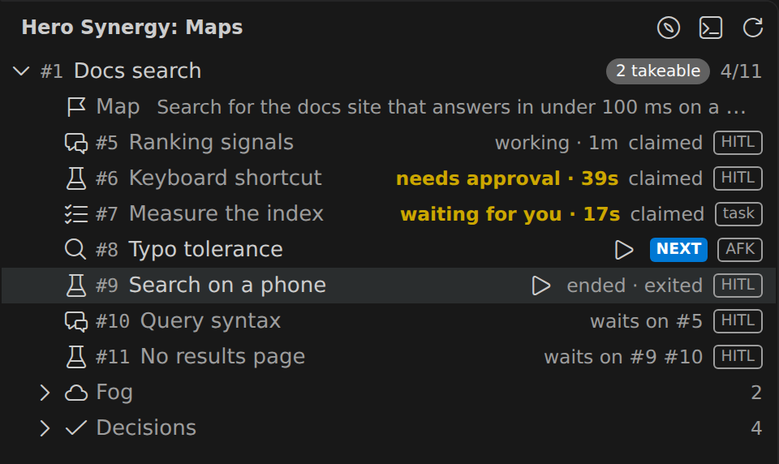 |
| The Tree, Light Modern |  | 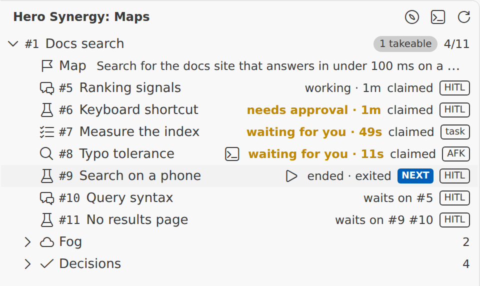 |
| Activity Bar badge |  | 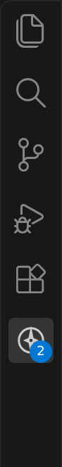 |
| Focus pane: Work ticket and its command |  | 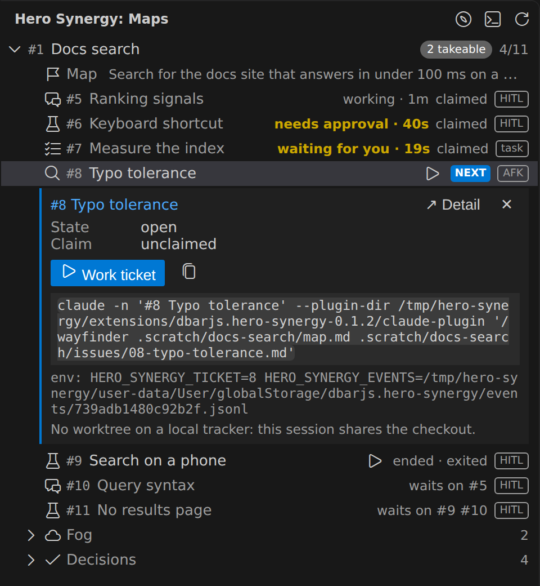 |
| Focus pane: a session waiting for you |  | 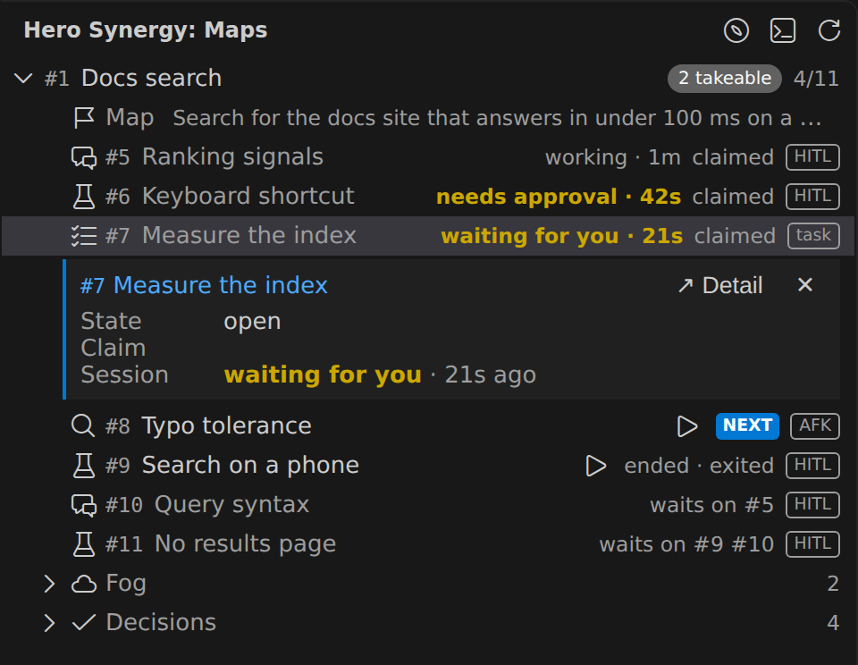 |
| Detail of the map |  | 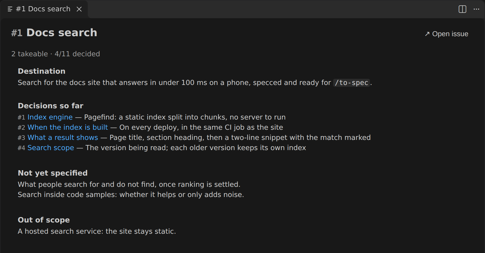 |
| Detail of a ticket, with its neighbourhood |  | 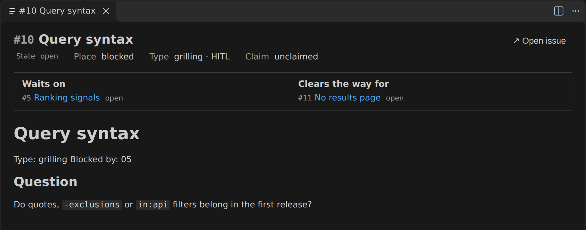 |
| The whole window |  | 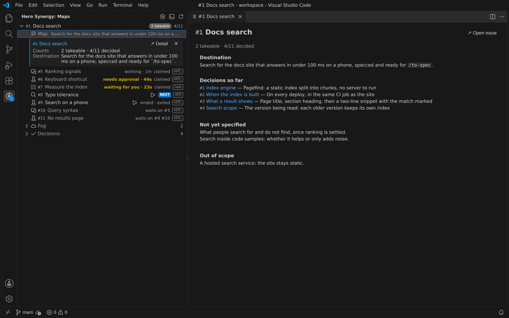 |
| A ticket session's terminal, beside the Tree |  | 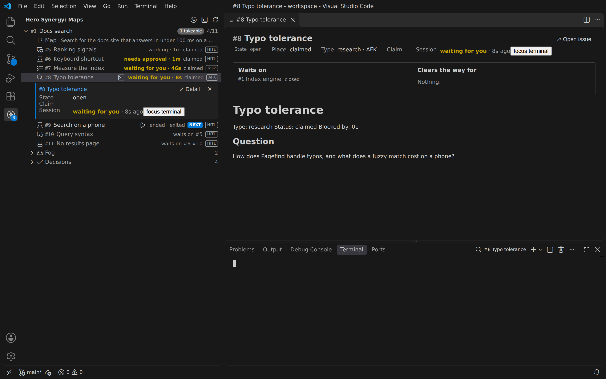 |

## The loop

▶ on #8 Typo tolerance. The terminal opens as `#8 Typo tolerance`, and the row goes from starting to live, then to "not claimed on the tracker". The session claims the ticket, and the row goes to working, then to waiting for you.

| | macOS | Linux |
| --- | --- | --- |
| GIF (Marketplace, Extensions view, GitHub) |  280 KB | 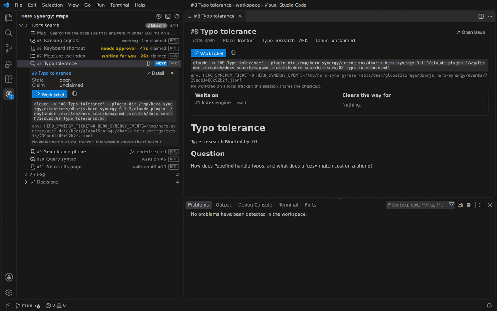 |
| Animated WebP | 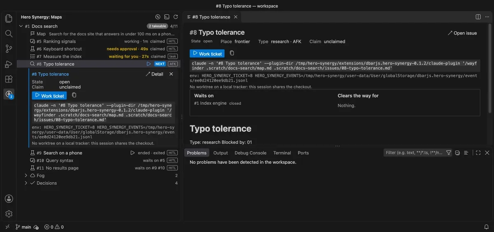 192 KB |  |
| MP4, for a GitHub `user-attachments` upload | [macos/launch.mp4](macos/launch.mp4) 228 KB | [linux/launch.mp4](linux/launch.mp4) |

## What a reader should know

- The terminal is empty: the stub `claude` prints nothing. A real Claude Code screen there would need a real session.
- The demo map is on the local tracker, which the ticket asked for, so the Work ticket command has no `-w <number>` ("No worktree on a local tracker: this session shares the checkout"). A GitHub map would show the worktree form.
- The Detail of a local ticket shows its file as written: a second title, then the `Type:` and `Blocked by:` lines as a paragraph. A GitHub issue's body starts at `## Question`.
- After the claim, the loop's Focus pane shows an empty Claim: a local ticket's `Status: claimed` names no one.
- The plugin and events paths in the command are the run's own, under `/tmp/hero-synergy`.
