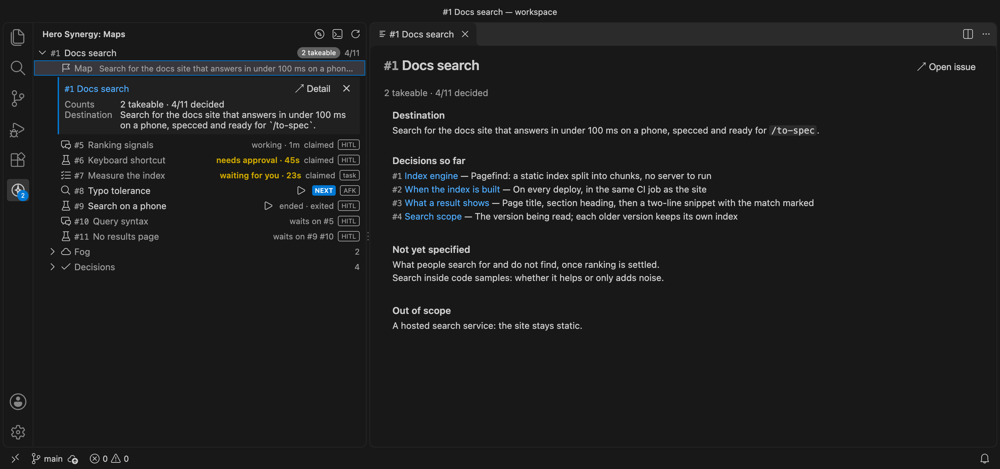
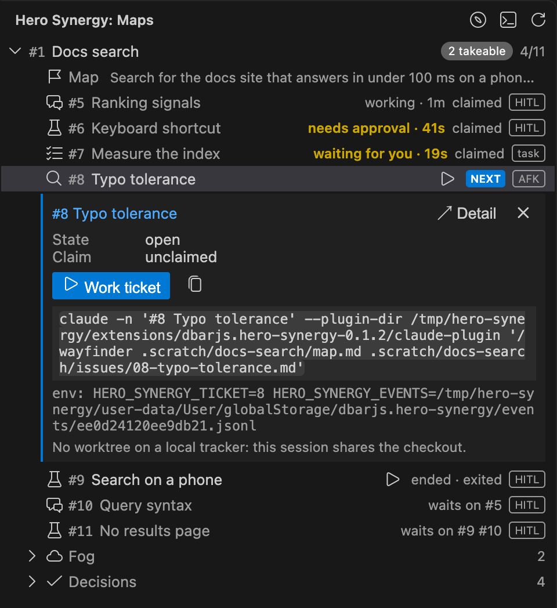
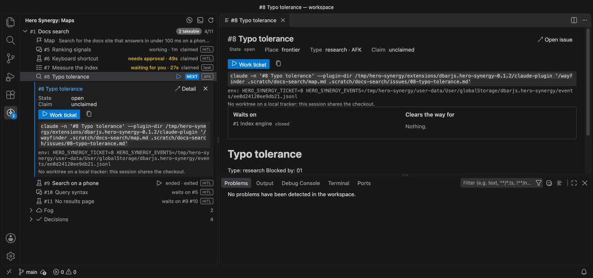
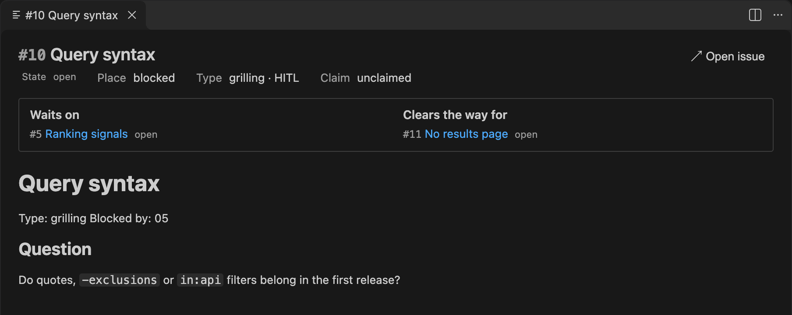
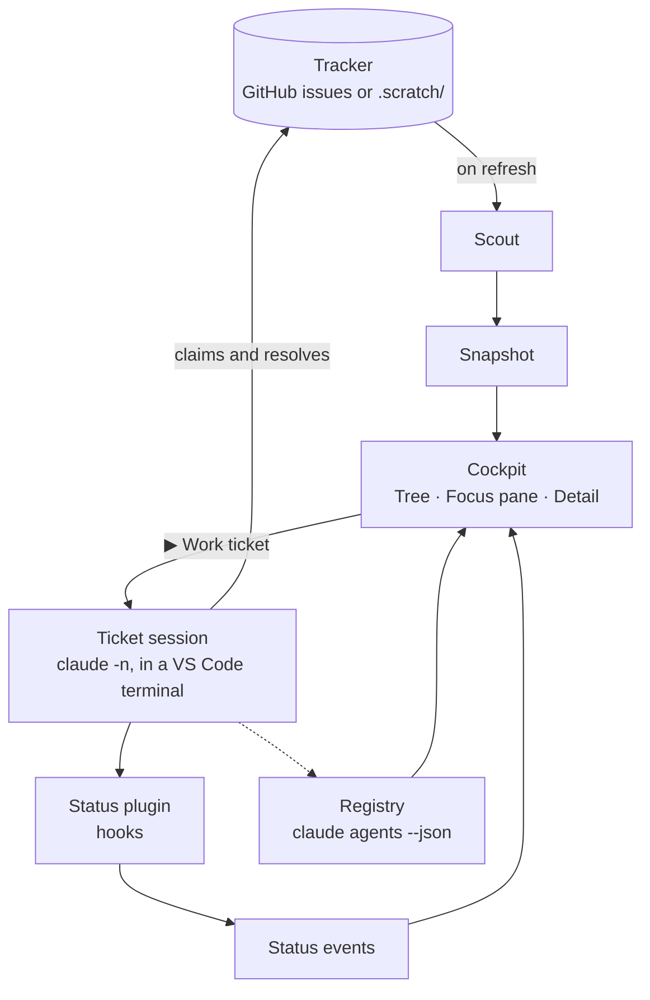

<p align="center">
  
</p>

<p align="center">
  <a href="https://marketplace.visualstudio.com/items?itemName=dbarjs.hero-synergy"></a>
  <a href="LICENSE"></a>
</p>

Hero Synergy is an unofficial Visual Studio Code cockpit for the wayfinder maps of [Matt Pocock's skills](https://github.com/mattpocock/skills). It shows each map's frontier, the tickets you can take right now, and starts any of them with one click as a [Claude Code](https://code.claude.com/docs) session named after the ticket. Every session's status stays in view, so you can see which one needs you.

Hero Synergy is a personal project and is not affiliated with or endorsed by Matt Pocock or Anthropic.

https://github.com/user-attachments/assets/e1d5cc19-a024-462d-8876-88391ef6157a



**One giant map. Too many terminals. Which one needs you?**

A wayfinder map holds more work than one agent session can, so you work its tickets in many sessions at once, often across several maps. Soon there are more terminals than you can watch, and the one waiting for you is somewhere among them.

## See the frontier

The Tree shows every open map of the repository, unfolded into its tickets. The frontier, the tickets you can take right now, each have a ▶, and the first in map order is marked NEXT. Blocked tickets say what they wait on.



## One click, one named session

▶ opens a terminal named `#<number> <title>` and starts the ticket's Claude Code session in it, running the wayfinder skill on that ticket. On a GitHub tracker the session gets its own worktree. The command is always shown before it runs.



## Live status for every session

Each session's status stays on its ticket: working, waiting for you, needs approval, failed or ended. The ones that need you count on the Activity Bar badge, and their map moves to the top.


## Close one, unblock the rest

The Detail shows a ticket in full: what it waits on and what it clears the way for. When a ticket closes, the tickets it was blocking join the frontier at the next refresh.



## Install

Install [Hero Synergy from the VS Code Marketplace](https://marketplace.visualstudio.com/items?itemName=dbarjs.hero-synergy), or run:

```sh
code --install-extension dbarjs.hero-synergy
```

It needs Claude Code, mattpocock-skills with the wayfinder skill, and `gh` for a GitHub tracker. The [extension's README](packages/vscode/README.md) has the requirements, a quick start from install to your first ticket session, and the settings, commands and conventions.

## How it works



- **The scout** reads the tracker that `/setup-matt-pocock-skills` recorded in `docs/agents/issue-tracker.md`, GitHub through `gh` or local markdown under `.scratch/`, and turns its open maps and their tickets into a **snapshot**: the typed state of every map at one moment, with any **drift** from the wayfinder conventions as warnings. It runs when something causes a refresh, never on a timer.
- **The Cockpit** draws the snapshot as the Tree and the Detail, and works out the frontier, the next ticket and each ticket's neighbours from it.
- **A ticket session** is a `claude` process in a VS Code terminal, named `#<number> <title>`. The Cockpit starts it with the wayfinder skill and the ticket, and leaves the work, the claim and the resolution to the session. On a GitHub tracker it runs in its own worktree, which the Cockpit shows but never creates, merges or removes.
- **Status** comes from two places. Claude Code's **registry** says whether each session is alive and busy, idle or waiting, whoever started it. The **status plugin**, a hooks plugin the Cockpit passes to the sessions it starts, adds what the registry can't: that a session failed, and why it ended.
- The tracker alone says whether a ticket is claimed, open or blocked; the session side alone says whether it is alive. Neither overrides the other, and the Cockpit shows where they disagree.

The vocabulary is in [`CONTEXT.md`](CONTEXT.md), the decisions in [`docs/adr/`](docs/adr), and every upstream the Cockpit relies on, with its floor and tested ceiling, in [`docs/upstream.md`](docs/upstream.md).

## Built with its own maps

Hero Synergy was charted and built with wayfinder maps, on this repository's issues:

- [#1 hero-synergy v0.1.0, fully decided](https://github.com/dbarjs/hero-synergy/issues/1): 33 tickets that decided what v0.1.0 is.
- [#37 Spec: hero-synergy v0.1.0, the Cockpit](https://github.com/dbarjs/hero-synergy/issues/37): the spec, built in 26 tickets.
- [#64 next, the terminal pre-alpha of the Cockpit](https://github.com/dbarjs/hero-synergy/issues/64): 6 tickets.
- [#22 The front door: READMEs, Marketplace listing and repository cards](https://github.com/dbarjs/hero-synergy/issues/22): this page.

## Packages

| Package                              | What it is                                                                                          |
| ------------------------------------ | --------------------------------------------------------------------------------------------------- |
| [`packages/vscode`](packages/vscode) | The extension, published as `dbarjs.hero-synergy`: the Cockpit, its webviews and the status plugin. |
| [`packages/core`](packages/core)     | The wayfinder map model, the tracker adapters and the scout, with no dependency on VS Code.         |
| [`packages/canary`](packages/canary) | The daily canary: runs the Cockpit's contracts against the newest upstreams and files the breaks.   |
| [`packages/cli`](packages/cli)       | A private placeholder. No CLI ships.                                                                |

## Developing

```sh
pnpm install
pnpm exec vp run -r build
pnpm exec vp check
pnpm exec vp test
pnpm exec vp run --filter hero-synergy package
```

`pnpm exec vp run capture` in `packages/vscode` takes the screenshots and the loop on this page again from the packaged extension.

<p align="center"><em>A hero with this many skills needs synergy.</em></p>

## Credits

Hero Synergy relies on the wayfinder conventions of [Matt Pocock's skills](https://github.com/mattpocock/skills) (MIT) and launches your own [Claude Code](https://code.claude.com/docs) CLI. It ships neither.

## Licence

[MIT](LICENSE)
