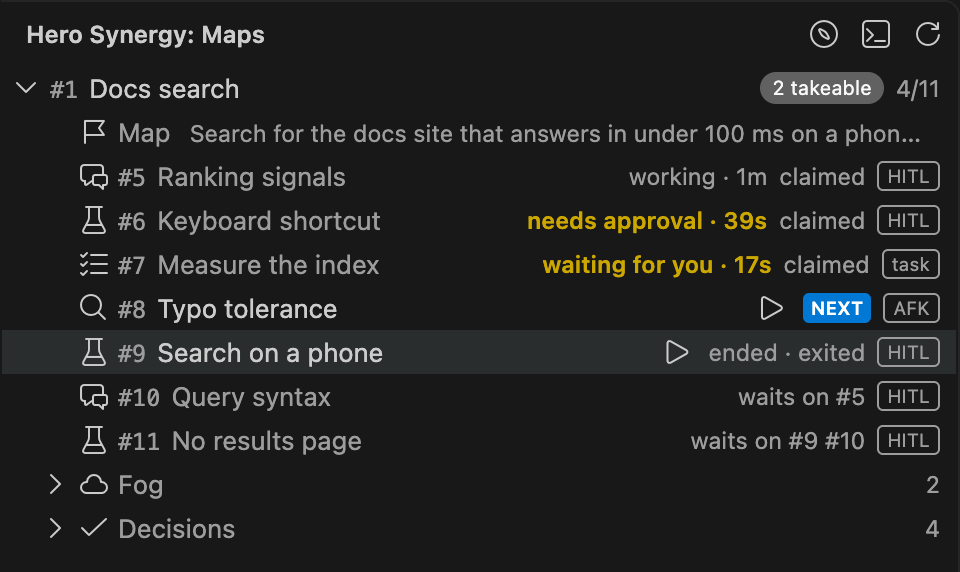
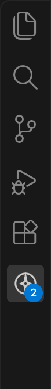
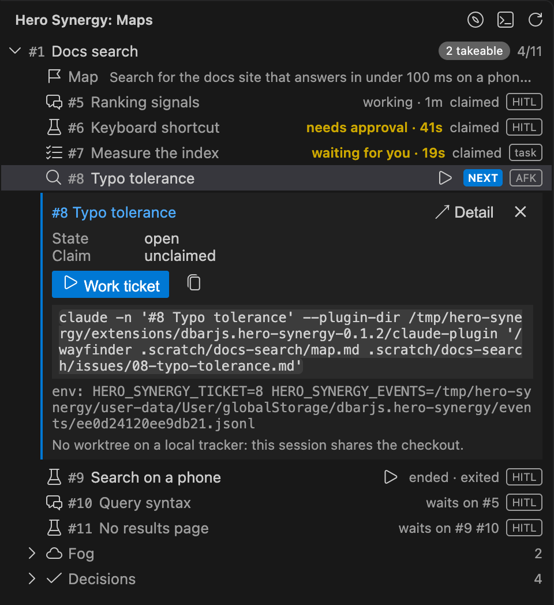
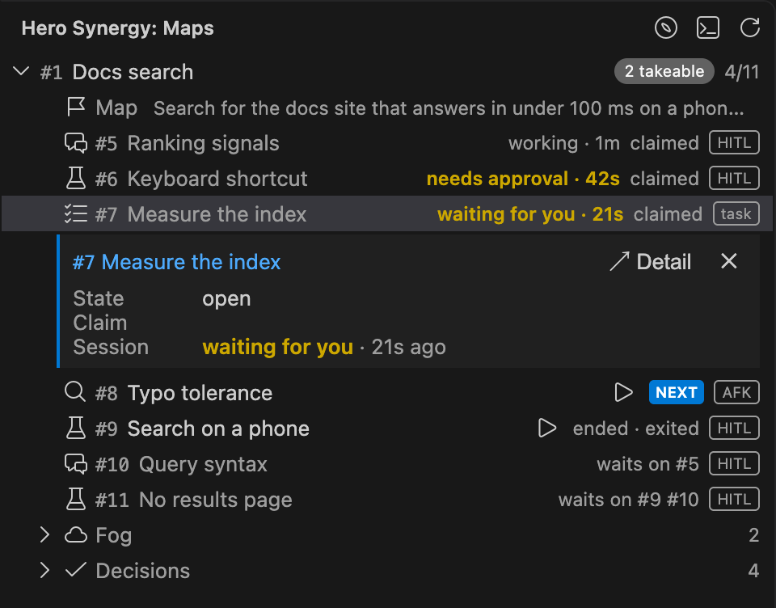
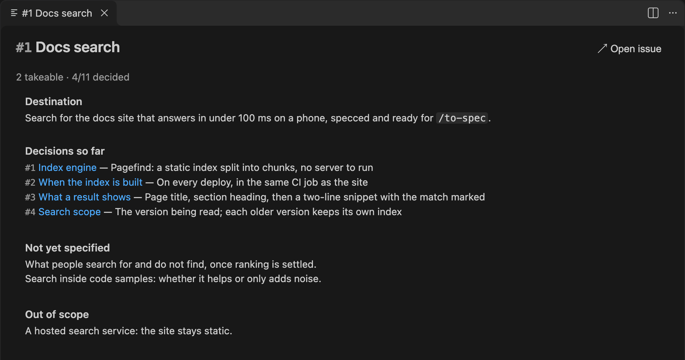
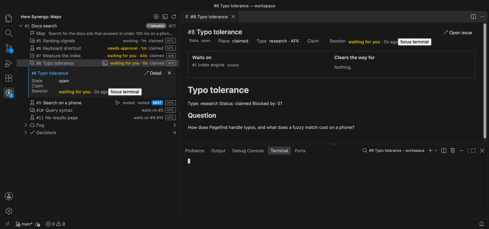
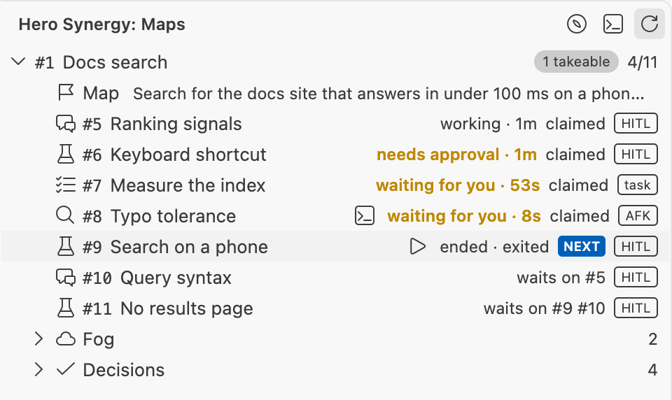

# Hero Synergy capture

- Taken by `vp run capture` from f200129 on darwin, VS Code stable, device scale 2.
- The workspace is the demo map on the local tracker; `claude` is the e2e tier’s stub, so the terminal stays empty.

## The Tree: the map unfolded, its frontier, sessions in every status

`tree-dark.png`

## The Activity Bar badge: two sessions need you

`badge.png`

## The Focus pane of #8 Typo tolerance: Work ticket and its exact command

`focus-pane.png`

## The Focus pane of #7 Measure the index: its session waiting for you

`focus-pane-session.png`

## The Detail of the map: destination, decisions, fog, out of scope

`detail-map.png`

## The whole window: the Tree beside the Detail of the map

`window-map.png`

## The Detail of #10 Query syntax: its question and neighbourhood

`detail-ticket.png`

## The loop as MP4: ▶, the named terminal, starting to working to waiting for you

`launch.mp4`

[launch.mp4](launch.mp4)

## The loop as GIF: ▶, the named terminal, starting to working to waiting for you

`launch.gif`

## The terminal of #8 Typo tolerance beside the Tree and its Detail

`terminal.png`

## The Tree in Light Modern

`tree-light.png`

