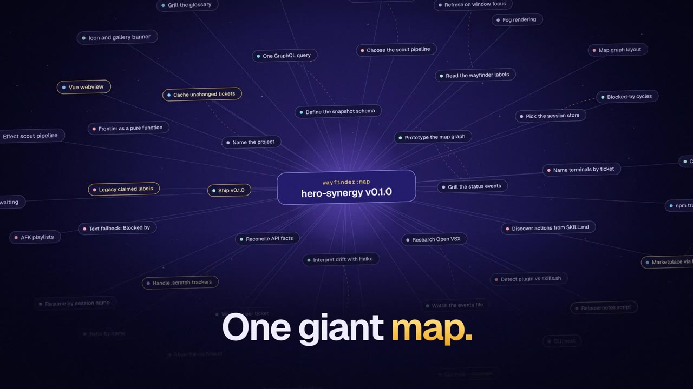

# Variant B: trailer first, left-aligned

> PROTOTYPE, throwaway: the first screen of the repository README only. The rest is the same as the [recommended draft](../README.md).

# Hero Synergy

_↑ Stand-in for the 15-second trailer cut, uploaded as a video by #120._

Hero Synergy is an unofficial Visual Studio Code cockpit for the wayfinder maps of [Matt Pocock's skills](https://github.com/mattpocock/skills). It shows each map's frontier, the tickets you can take right now, and starts any of them with one click as a [Claude Code](https://code.claude.com/docs) session named after the ticket. Every session's status stays in view, so you can see which one needs you.

Hero Synergy is a personal project and is not affiliated with or endorsed by Matt Pocock or Anthropic.

**One giant map. Too many terminals. Which one needs you?**

…
